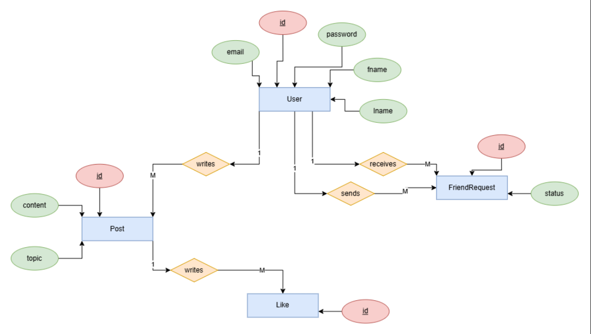

# ZapVerse: Connect, Share, and Discover in a Vibrant New Social Universe

Welcome to **ZapVerse**, the social media application built by **ZapLink**, designed to connect people and communities in an instant, engaging, and secure online environment. Dive into a dynamic platform where sharing your moments, engaging with friends, and exploring new interests is effortless and intuitive.

---

## Features (Planned/Under Development)

- **Real-time Interactions**  
  Experience seamless communication with instant messaging, live updates, and interactive feeds.

- **Personalized Feeds**  
  Discover content tailored to your interests, friends, and communities.

- **Rich Media Sharing**  
  Easily share photos, videos, and stories with powerful editing tools.

- **Intuitive User Interface**  
  A clean, modern design focused on ease of use and a delightful user experience.

---
## ER-Diagram



---

## Technology Stack

ZapVerse is built with a modern, scalable, and robust technology stack:

- **Backend**: Spring Boot (Java) – Leveraging its rapid development and enterprise-grade capabilities.
- **Database**: H2 (in-memory for development; configurable for PostgreSQL/Superbase)
- **Frontend**: Thymeleaf (Server-Side Rendered HTML)
- **Build Tool**: Maven

---

## Getting Started

To get **ZapVerse** up and running on your local machine, follow these steps:

### Prerequisites

- Java Development Kit (JDK) 21
- Maven

### Clone the Repository

```bash
git clone https://github.com/ZapLink/ZapVerse.git
cd ZapVerse
